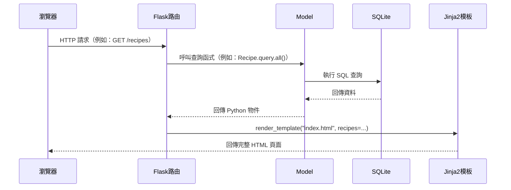
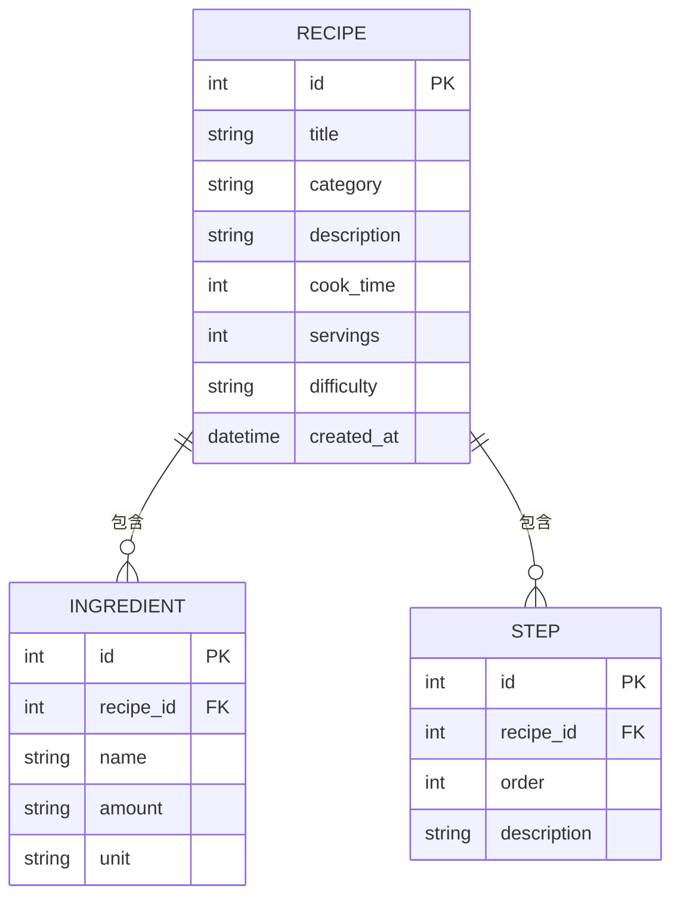

# 食譜收藏夾系統 — 系統架構文件 (ARCHITECTURE)

**版本**：v1.0  
**撰寫日期**：2026-04-13  
**對應 PRD**：docs/PRD.md v1.0

---

## 1. 技術架構說明

### 1.1 選用技術與原因

| 技術 | 選用原因 |
|------|----------|
| **Python Flask** | 輕量、易學，適合初學者快速建立網頁後端，社群資源豐富 |
| **Jinja2** | Flask 內建模板引擎，可直接在 HTML 裡嵌入 Python 資料，不需要另外設定 |
| **SQLite** | 不需要安裝資料庫伺服器，資料存成單一 `.db` 檔案，適合本機開發與小型專案 |
| **SQLAlchemy** | Python 的 ORM 工具，讓你用 Python 程式碼操作資料庫，不用直接寫 SQL |
| **HTML5 + Vanilla CSS** | 不依賴外部框架，適合學習基礎前端概念，也讓專案保持輕巧 |

### 1.2 MVC 模式說明

本專案採用 **MVC（Model / View / Controller）** 架構：

| 層級 | 對應技術 | 負責的事 |
|------|----------|----------|
| **Model（模型）** | SQLAlchemy + SQLite | 定義資料結構（食譜、食材、步驟），負責讀寫資料庫 |
| **View（視圖）** | Jinja2 HTML 模板 | 決定頁面長什麼樣子，把資料填入 HTML 呈現給使用者 |
| **Controller（控制器）** | Flask 路由（routes） | 接收使用者的請求，呼叫 Model 取得資料，再交給 View 顯示 |

---

## 2. 專案資料夾結構

```
web_app_development/        ← 專案根目錄
│
├── app/                    ← 主要應用程式程式碼
│   │
│   ├── models/             ← Model 層：資料庫模型定義
│   │   ├── __init__.py     ← 讓 Python 認識這個資料夾是套件
│   │   ├── recipe.py       ← 食譜資料表（Recipe）
│   │   ├── ingredient.py   ← 食材資料表（Ingredient）
│   │   └── step.py         ← 步驟資料表（Step）
│   │
│   ├── routes/             ← Controller 層：Flask 路由（URL 對應哪個功能）
│   │   ├── __init__.py
│   │   └── recipe_routes.py ← 食譜相關的所有路由（新增、列表、詳細、編輯、刪除）
│   │
│   ├── templates/          ← View 層：Jinja2 HTML 模板
│   │   ├── base.html       ← 共用版型（導覽列、頁尾）
│   │   ├── index.html      ← 首頁：食譜列表
│   │   ├── recipe_detail.html  ← 食譜詳細頁（食材 + 步驟）
│   │   ├── recipe_form.html    ← 新增 / 編輯食譜表單
│   │   └── search.html     ← 搜尋結果頁
│   │
│   ├── static/             ← 靜態資源（不需要後端處理的檔案）
│   │   ├── css/
│   │   │   └── style.css   ← 全站樣式
│   │   └── js/
│   │       └── main.js     ← 前端互動邏輯（表單驗證等）
│   │
│   └── __init__.py         ← 建立 Flask app、初始化資料庫
│
├── instance/               ← 執行時自動產生，不放進 Git
│   └── database.db         ← SQLite 資料庫檔案
│
├── docs/                   ← 專案文件
│   ├── PRD.md              ← 產品需求文件
│   └── ARCHITECTURE.md     ← 本文件
│
├── app.py                  ← 程式進入點，啟動 Flask 伺服器
├── requirements.txt        ← Python 套件清單（flask, sqlalchemy 等）
└── README.md               ← 專案說明
```

---

## 3. 元件關係圖

### 3.1 請求處理流程



### 3.2 資料模型關係



---

## 4. 頁面路由規劃

| HTTP 方法 | URL 路徑 | 對應功能 | 對應模板 |
|-----------|----------|----------|----------|
| GET | `/` | 首頁，顯示所有食譜 | `index.html` |
| GET | `/recipes/new` | 顯示新增食譜表單 | `recipe_form.html` |
| POST | `/recipes/new` | 送出新增食譜 | 重導向到詳細頁 |
| GET | `/recipes/<id>` | 顯示食譜詳細頁 | `recipe_detail.html` |
| GET | `/recipes/<id>/edit` | 顯示編輯食譜表單 | `recipe_form.html` |
| POST | `/recipes/<id>/edit` | 送出編輯結果 | 重導向到詳細頁 |
| POST | `/recipes/<id>/delete` | 刪除食譜 | 重導向到首頁 |
| GET | `/search` | 搜尋 / 篩選結果 | `search.html` |

---

## 5. 關鍵設計決策

### 決策 1：使用 SQLAlchemy ORM 而非直接寫 SQL

**原因**：SQLAlchemy 讓開發者用 Python 物件操作資料庫，程式碼更直觀、不容易出錯。對初學者來說也更容易學習，且自動處理部分安全防護（避免 SQL Injection）。

### 決策 2：食材與步驟獨立成資料表

**原因**：一道食譜有多種食材、多個步驟，數量不固定。若存在同一個欄位裡（如用逗號分隔），後續查詢與編輯都很麻煩。獨立成 `Ingredient` 和 `Step` 資料表，結構清晰，方便增刪改查。

### 決策 3：所有頁面共用 `base.html` 版型

**原因**：導覽列、頁首、頁尾等重複的 HTML 只需要寫一次，其他頁面用 Jinja2 的 `` 繼承，維護方便，修改一處全站更新。

### 決策 4：使用 POST-Redirect-GET 模式處理表單

**原因**：使用者送出表單（POST）後，立刻重導向到另一個頁面（GET）。這樣即使使用者重新整理頁面，也不會重複送出表單，避免重複新增資料。

### 決策 5：`instance/` 資料夾加入 `.gitignore`

**原因**：`database.db` 是執行時自動產生的資料庫檔案，不應該放進 Git 版本控制，避免將測試資料或個人資料一起上傳到 GitHub。

---

*本文件為活文件，隨開發進度持續更新。*
