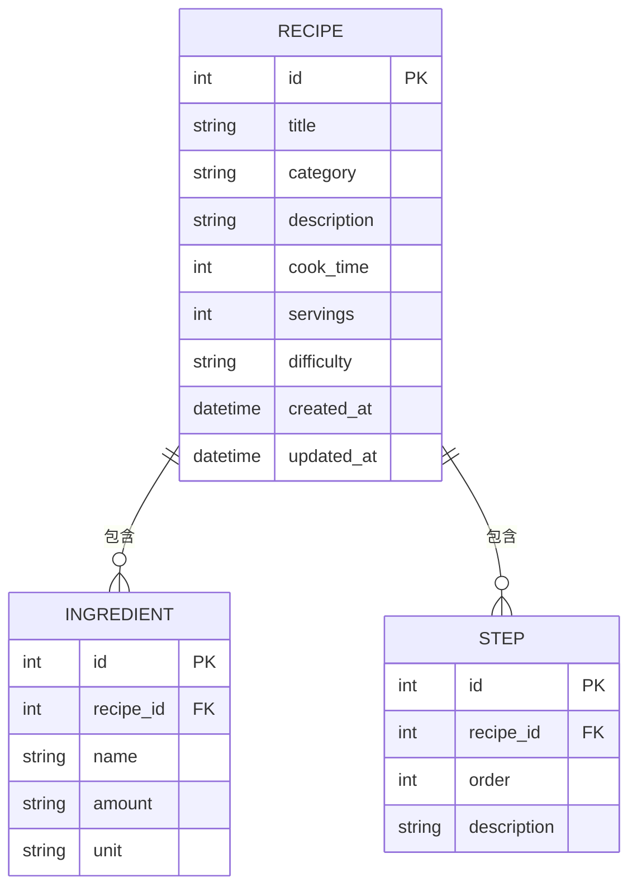

# 食譜收藏夾系統 — 資料庫設計文件 (DB_DESIGN)

**版本**：v1.0  
**撰寫日期**：2026-04-16  
**對應文件**：docs/PRD.md、docs/ARCHITECTURE.md、docs/FLOWCHART.md

---

## 1. ER 圖（實體關係圖）

---

## 2. 資料表詳細說明

### 2.1 RECIPE（食譜）

| 欄位名稱     | 型別     | 必填 | 說明                                         |
|-------------|----------|------|----------------------------------------------|
| `id`        | INTEGER  | ✅   | 主鍵，自動遞增                                |
| `title`     | TEXT     | ✅   | 食譜名稱                                      |
| `category`  | TEXT     | ✅   | 分類標籤（早餐、午餐、晚餐、甜點、飲品等）     |
| `description`| TEXT    | ❌   | 食譜簡介描述                                  |
| `cook_time` | INTEGER  | ❌   | 烹調時間（分鐘）                              |
| `servings`  | INTEGER  | ❌   | 份量（幾人份）                                |
| `difficulty`| TEXT     | ❌   | 難易度（簡單、普通、進階）                    |
| `created_at`| DATETIME | ✅   | 新增時間，自動填入                            |
| `updated_at`| DATETIME | ✅   | 最後更新時間，自動填入                        |

**主鍵（PK）**：`id`

---

### 2.2 INGREDIENT（食材）

| 欄位名稱    | 型別    | 必填 | 說明                       |
|------------|---------|------|----------------------------|
| `id`       | INTEGER | ✅   | 主鍵，自動遞增              |
| `recipe_id`| INTEGER | ✅   | 外鍵，對應 `recipe.id`      |
| `name`     | TEXT    | ✅   | 食材名稱（例：雞蛋）        |
| `amount`   | TEXT    | ❌   | 份量數值（例：2）           |
| `unit`     | TEXT    | ❌   | 單位（例：顆、克、毫升）    |

**主鍵（PK）**：`id`  
**外鍵（FK）**：`recipe_id` → `recipe.id`（CASCADE DELETE）

---

### 2.3 STEP（烹調步驟）

| 欄位名稱     | 型別    | 必填 | 說明                              |
|-------------|---------|------|-----------------------------------|
| `id`        | INTEGER | ✅   | 主鍵，自動遞增                     |
| `recipe_id` | INTEGER | ✅   | 外鍵，對應 `recipe.id`             |
| `order`     | INTEGER | ✅   | 步驟順序編號（從 1 開始）          |
| `description`| TEXT   | ✅   | 步驟說明內容                       |

**主鍵（PK）**：`id`  
**外鍵（FK）**：`recipe_id` → `recipe.id`（CASCADE DELETE）

---

## 3. SQL 建表語法

詳見 `database/schema.sql`。

---

## 4. 欄位命名規則

- 所有欄位使用 **snake_case**
- 主鍵一律命名為 `id`
- 外鍵命名格式為 `[參照資料表單數]_id`
- 時間欄位使用 SQLAlchemy `DateTime` 型別

---

## 5. 資料關聯說明

| 關聯 | 類型 | 說明 |
|------|------|------|
| Recipe → Ingredient | 一對多（1:N） | 一道食譜有多個食材，刪除食譜時同步刪除 |
| Recipe → Step | 一對多（1:N） | 一道食譜有多個步驟，刪除食譜時同步刪除 |

---

*本文件為活文件，隨開發進度持續更新。*
