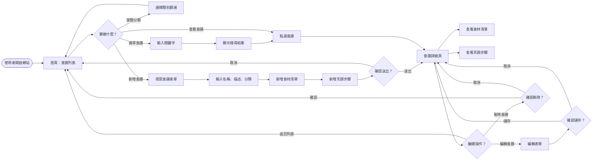
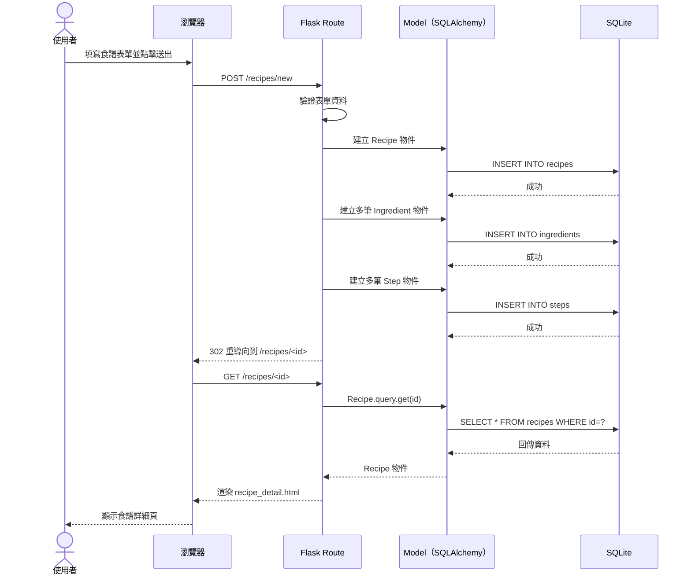
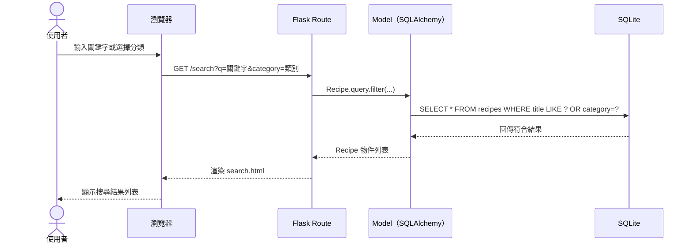
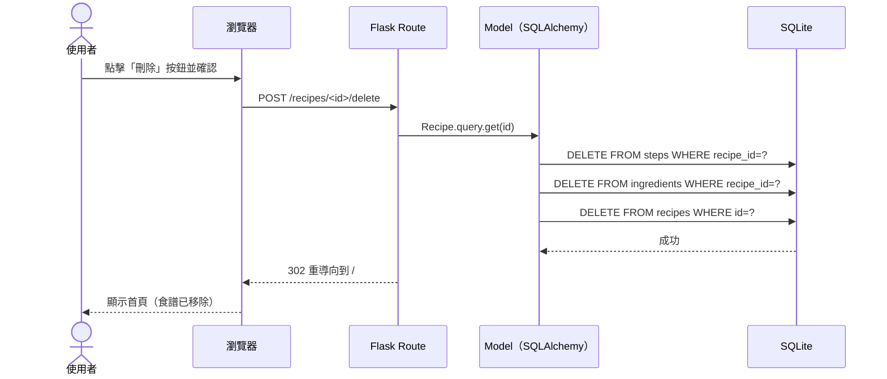

# 食譜收藏夾系統 — 流程圖文件 (FLOWCHART)

**版本**：v1.0  
**撰寫日期**：2026-04-13  
**對應文件**：docs/PRD.md、docs/ARCHITECTURE.md

---

## 1. 使用者流程圖（User Flow）

描述使用者從進入網站到完成各項操作的完整路徑。

---

## 2. 系統序列圖（Sequence Diagram）

### 2.1 新增食譜

描述使用者填寫表單送出後，資料儲存至資料庫的完整流程。

### 2.2 瀏覽與搜尋食譜

### 2.3 刪除食譜

---

## 3. 功能清單對照表

| 功能 | HTTP 方法 | URL 路徑 | 對應模板 | 說明 |
|------|-----------|----------|----------|------|
| 首頁 / 食譜列表 | GET | `/` | `index.html` | 顯示所有食譜，可依類別篩選 |
| 顯示新增表單 | GET | `/recipes/new` | `recipe_form.html` | 空白表單供使用者填寫 |
| 送出新增食譜 | POST | `/recipes/new` | 重導向 | 驗證並儲存食譜至資料庫 |
| 食譜詳細頁 | GET | `/recipes/<id>` | `recipe_detail.html` | 顯示完整食材與步驟 |
| 顯示編輯表單 | GET | `/recipes/<id>/edit` | `recipe_form.html` | 預填現有資料供修改 |
| 送出編輯食譜 | POST | `/recipes/<id>/edit` | 重導向 | 更新資料庫中的食譜資料 |
| 刪除食譜 | POST | `/recipes/<id>/delete` | 重導向 | 刪除食譜及其食材、步驟 |
| 搜尋 / 篩選 | GET | `/search` | `search.html` | 依關鍵字或類別過濾食譜 |

---

*本文件為活文件，隨開發進度持續更新。*
